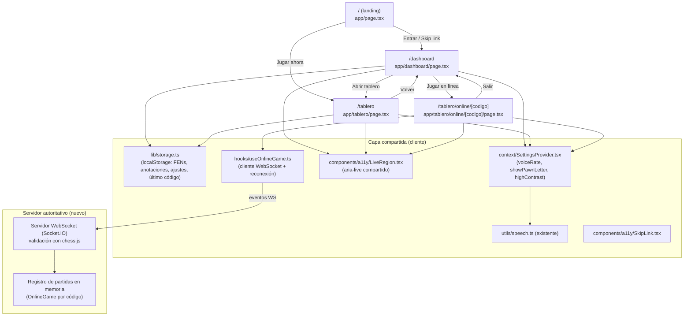
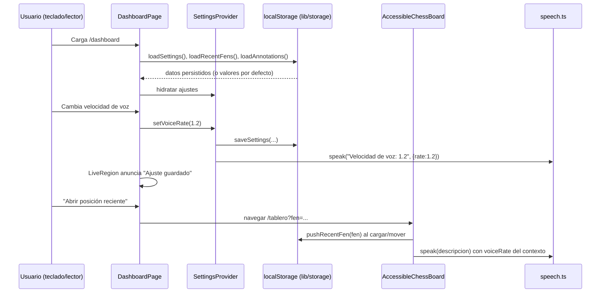
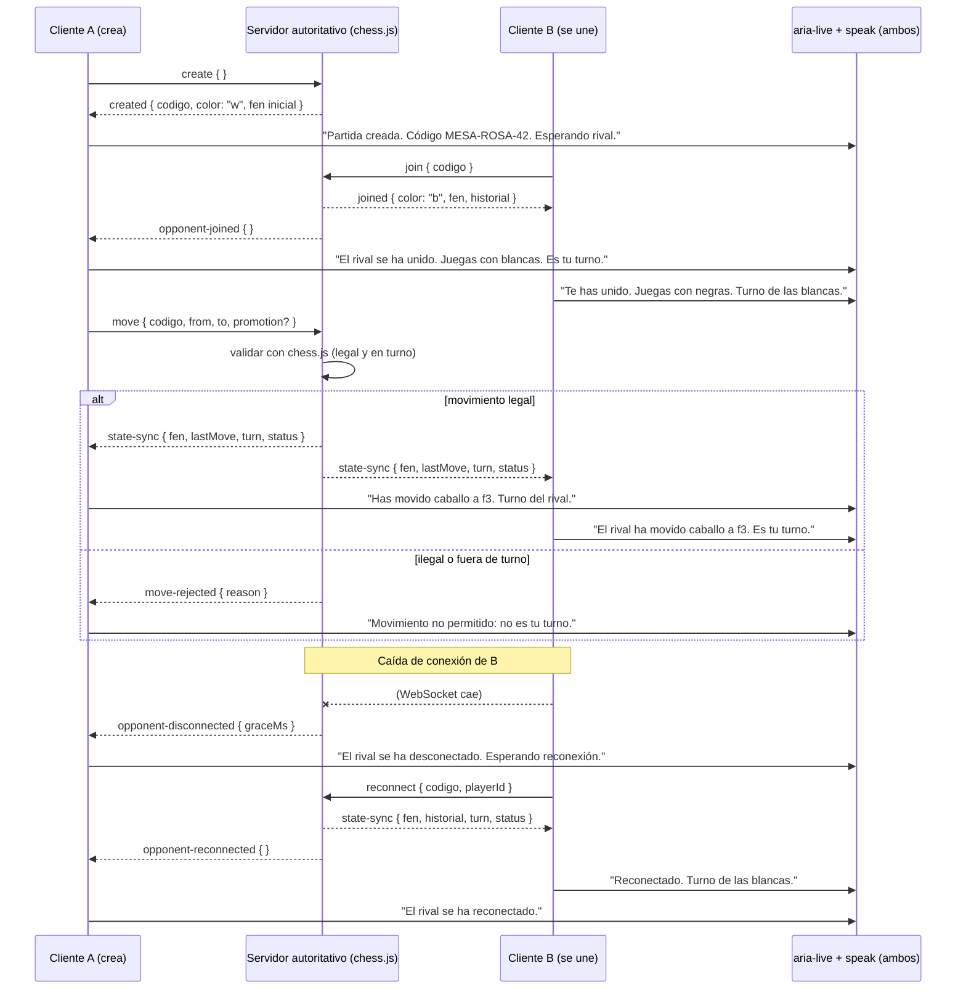

# Design Document: Landing y Dashboard (ONCE Chess)

## Overview

Esta funcionalidad añade dos superficies nuevas al producto **once-chess** (ajedrez accesible afiliado a la ONCE / Comisión Braille Española): una **landing page** en `/` que explica el proyecto y su misión de accesibilidad, y un **dashboard inicial** en `/dashboard` que actúa como centro accesible de acceso al tablero, posiciones recientes (FEN), anotaciones guardadas y ajustes (velocidad de voz, mostrar letra en peones, alto contraste). El tablero actual (`AccessibleChessBoard`) se traslada a `/tablero` y queda accesible desde ambas superficies.

Todo el producto es **accesibilidad primero para personas ciegas y con baja visión**. Cada decisión de UI prioriza lectores de pantalla, navegación por teclado, regiones ARIA en vivo (`aria-live`), alto contraste, respeto de `prefers-reduced-motion` y realimentación por voz mediante la Web Speech API ya existente (`src/utils/speech.ts`). La copia de interfaz está en **español**, y se reutilizan los tokens de diseño ONCE (`--once-accent`, `--once-ink`, `--once-muted`, `--once-panel`, `--once-ring`, `--once-bg`, `--once-focus`) y las utilidades `once-btn`, `once-btn-primary`, `once-btn-active` definidas en `globals.css`.

El diseño reutiliza deliberadamente los patrones ya establecidos en `AccessibleChessBoard.tsx`: región `aria-live="polite"` con `aria-atomic`, texto `sr-only`, anillos `focus-visible`, `role`/`aria-label` en español y realimentación por voz con `speak(...)`. La persistencia local es ligera (`localStorage`) porque el ámbito de un solo usuario en su dispositivo no requiere autenticación ni sincronización entre equipos; se justifica más abajo.

### Ampliación: modo en línea (multijugador en red)

Esta revisión añade un **modo en línea** que permite que **dos personas ciegas o con baja visión jueguen una partida de ajedrez entre sí a través de la red, en tiempo real**. La accesibilidad sigue siendo el principio rector: **cada evento de red** (rival conectado, movimiento del rival, cambio de turno, jaque/jaque mate, desconexión, reconexión, oferta de tablas, rendición y, opcionalmente, el reloj) **se anuncia en español por `aria-live` y por la Web Speech API**, reutilizando el `useAnnouncer` y los patrones ya descritos. Un jugador ciego debe conocer siempre el estado de la partida sin ayuda de una persona vidente.

A diferencia del resto del producto —que es sólo cliente—, el modo en línea introduce una **preocupación de servidor/backend** (sincronización y autoridad de estado). Este backend **coexiste** con las piezas cliente existentes sin modificarlas: la landing sigue siendo estática, el dashboard y el tablero local siguen funcionando con `localStorage` y sin red, y el modo en línea se activa sólo en su propia ruta. El backend es **autoritativo**: valida cada movimiento con `chess.js` en el servidor, mantiene el `fen` e historial oficiales y difunde el estado a ambos clientes, de modo que ningún cliente puede aplicar un movimiento ilegal o fuera de turno al estado autoritativo. Los modelos de `localStorage` (Settings, RecentPosition, Annotation) se conservan intactos; sólo se persiste localmente, de forma opcional, el **último código de partida** para facilitar la reconexión.

---

## Architecture

### Rutas (Next.js App Router)



Decisión de rutas: la landing ocupa `/` (primera impresión pública, poca carga cognitiva), el hub operativo vive en `/dashboard`, y el tablero se mueve a `/tablero` para que ambas superficies lo enlacen sin duplicar el componente. El `page.tsx` actual (que hoy renderiza el tablero directamente) se sustituye por la landing; el tablero se mueve a `app/tablero/page.tsx` sin cambios de lógica interna. El **modo en línea** vive en `/tablero/online/[codigo]`: el segmento dinámico `[codigo]` es el código de partida compartible, de modo que un enlace directo (`/tablero/online/MESA-ROSA-42`) permite unirse a una partida existente; sin código, se ofrece crear una nueva. El servidor WebSocket es un proceso Node independiente (o un handler adjunto) que **no interfiere** con las rutas cliente-only.

### Árbol de componentes

```mermaid
graph TD
    Layout["RootLayout (app/layout.tsx)\nlang=es, fuentes, SettingsProvider, SkipLink"]
    Layout --> LandingPage["LandingPage (/)"]
    Layout --> DashboardPage["DashboardPage (/dashboard)"]
    Layout --> BoardPage["BoardPage (/tablero)"]
    Layout --> OnlinePage["OnlineGamePage (/tablero/online/[codigo])"]

    LandingPage --> SkipLink1["SkipLink"]
    LandingPage --> Hero["Hero (h1 + misión + CTA)"]
    LandingPage --> Features["FeatureList (accesibilidad)"]
    LandingPage --> CtaBar["CTA: Entrar al panel / Jugar"]

    DashboardPage --> SkipLink2["SkipLink"]
    DashboardPage --> DashHeader["DashboardHeader (h1, saludo)"]
    DashboardPage --> QuickAccess["QuickAccessCard (Abrir tablero)"]
    DashboardPage --> RecentFens["RecentPositionsList (FEN recientes)"]
    DashboardPage --> Annotations["SavedAnnotationsList"]
    DashboardPage --> SettingsPanel["SettingsPanel (voz, peón, contraste)"]
    DashboardPage --> DashLive["LiveRegion (aria-live)"]

    BoardPage --> Board["AccessibleChessBoard (existente, extendido)"]

    OnlinePage --> SkipLink3["SkipLink"]
    OnlinePage --> OnlineProvider["OnlineGameProvider (useOnlineGame)"]
    OnlineProvider --> Lobby["OnlineLobby (crear / unirse + código legible)"]
    OnlineProvider --> OnlineBoard["AccessibleChessBoard (reutilizado, controlado por red)"]
    OnlineProvider --> OnlineControls["OnlineControls (rendirse, ofrecer/aceptar tablas)"]
    OnlineProvider --> OnlineStatus["OnlineStatus (turno, conexión, reloj opcional)"]
    OnlineProvider --> OnlineLive["LiveRegion (aria-live, anuncios de red)"]
```



### Flujo de datos



### Flujo cliente-servidor del modo en línea (crear / unir / mover / reconectar)



---

## Components and Interfaces

### Componente 1: `SettingsProvider` (`src/context/SettingsProvider.tsx`)

**Propósito**: Estado global de ajustes de accesibilidad, hidratado desde `localStorage`, aplicado como atributos en `<html>` (alto contraste) y consumido por el tablero (voz, letra de peón).

**Interfaz**:

```typescript
export type Settings = {
  voiceRate: number;        // 0.5–2.0, paso 0.1
  showPawnLetter: boolean;  // muestra "P" en peones (Braille)
  highContrast: boolean;    // activa tema de alto contraste
  speechEnabled: boolean;   // permite silenciar la voz por completo
};

export type SettingsContextValue = {
  settings: Settings;
  setVoiceRate: (rate: number) => void;
  toggleShowPawnLetter: () => void;
  toggleHighContrast: () => void;
  toggleSpeech: () => void;
  resetSettings: () => void;
};

export const DEFAULT_SETTINGS: Settings;
export function SettingsProvider(props: { children: React.ReactNode }): JSX.Element;
export function useSettings(): SettingsContextValue;
```

**Responsabilidades**:
- Cargar ajustes al montar (sólo en cliente) y escribir en cada cambio.
- Reflejar `highContrast` como `data-contrast="high"` en `<html>` para que CSS aplique el tema.
- Exponer `voiceRate` a `speak(...)` para que todos los anuncios respeten la preferencia.

### Componente 2: `LiveRegion` (`src/components/a11y/LiveRegion.tsx`)

**Propósito**: Región compartida `aria-live` reutilizable (mismo patrón que el `liveId` de `AccessibleChessBoard`) para que dashboard y ajustes anuncien cambios de estado sin duplicar markup.

**Interfaz**:

```typescript
export type LiveRegionProps = {
  message: string;
  politeness?: "polite" | "assertive"; // por defecto "polite"
  id?: string;
};
export function LiveRegion(props: LiveRegionProps): JSX.Element; // <p class="sr-only" aria-live aria-atomic>

// Hook auxiliar para orquestar anuncio visual + voz
export function useAnnouncer(): {
  message: string;
  announce: (text: string, opts?: { speak?: boolean; assertive?: boolean }) => void;
};
```

**Responsabilidades**:
- Renderizar un `<p class="sr-only" aria-live="polite" aria-atomic="true">`.
- `useAnnouncer` combina `setMessage` + `speak(text, { rate: voiceRate })` respetando `speechEnabled`.

### Componente 3: `SkipLink` (`src/components/a11y/SkipLink.tsx`)

**Propósito**: Enlace "Saltar al contenido principal" visible sólo al recibir foco (primer tabulador de cada página).

**Interfaz**:

```typescript
export type SkipLinkProps = { targetId: string; label?: string }; // label por defecto "Saltar al contenido principal"
export function SkipLink(props: SkipLinkProps): JSX.Element;
```

**Responsabilidades**:
- `href="#${targetId}"`, oculto con `sr-only` salvo `:focus-visible`.
- El `<main>` de cada página lleva `id={targetId}` y `tabIndex={-1}`.

### Componente 4: `LandingPage` (`src/app/page.tsx`)

**Propósito**: Home pública que explica misión y ofrece punto de entrada accesible.

**Estructura semántica** (landmarks): `header > nav`, `main#contenido > section[aria-labelledby]` (hero, características, CTA), `footer`.

**Interfaz**: Server Component sin props (contenido estático); la barra de CTA usa `next/link` a `/dashboard` y `/tablero`.

### Componente 5: `DashboardPage` (`src/app/dashboard/page.tsx`)

**Propósito**: Hub operativo tras entrar. Client Component que consume `useSettings` y `lib/storage`.

**Estructura semántica**: `main#contenido` con secciones etiquetadas: Acceso rápido, Posiciones recientes, Anotaciones guardadas, Ajustes; más `LiveRegion`.

### Componente 6: `AccessibleChessBoard` (existente, extendido)

**Cambios**: acepta `voiceRate`/`showPawnLetter` desde `useSettings` (en lugar de estado local para la letra de peón), y llama a `pushRecentFen` al cargar un FEN o completar un movimiento. No se altera su lógica de ajedrez ni su accesibilidad actual.

**Reutilización en línea**: el mismo componente se emplea en el modo en línea en modo **controlado**: recibe el `fen` autoritativo y un `orientation` según el color del jugador, y en lugar de aplicar el movimiento localmente delega en un callback `onAttemptMove(from, to, promotion)` que lo envía al servidor. El estado sólo cambia cuando llega el `state-sync` autoritativo, evitando divergencias.

### Componente 7: `OnlineGameProvider` / `useOnlineGame` (`src/hooks/useOnlineGame.ts`)

**Propósito**: Encapsular el ciclo de vida de la conexión WebSocket, el estado autoritativo recibido y los anuncios accesibles de cada evento de red. Es la única pieza que habla con el servidor.

**Interfaz**:

```typescript
export type OnlineStatus =
  | "conectando" | "esperando-rival" | "en-juego"
  | "rival-desconectado" | "reconectando"
  | "finalizada" | "error";

export type OnlineGameState = {
  codigo: string;
  status: OnlineStatus;
  color: "w" | "b" | null;   // color asignado a este cliente
  fen: string;               // FEN autoritativo actual
  historial: string[];       // SAN de la partida (autoritativo)
  turno: "w" | "b";
  esMiTurno: boolean;
  jaque: boolean;
  resultado: "en-curso" | "jaque-mate" | "tablas" | "rendicion" | "abandono";
  ganador: "w" | "b" | null;
  ofertaTablasPendiente: "yo" | "rival" | null;
  relojMs?: { w: number; b: number }; // opcional
};

export type UseOnlineGame = {
  state: OnlineGameState;
  crearPartida: () => void;
  unirse: (codigo: string) => void;
  intentarMovimiento: (from: string, to: string, promotion?: string) => void;
  ofrecerTablas: () => void;
  aceptarTablas: () => void;
  rechazarTablas: () => void;
  rendirse: () => void;
  reconectar: () => void;
};

export function useOnlineGame(initialCodigo?: string): UseOnlineGame;
```

**Responsabilidades**:
- Abrir/mantener el socket, reintentar reconexión con backoff y `playerId` persistido.
- Traducir **cada** mensaje entrante (`opponent-joined`, `state-sync`, `move-rejected`, `opponent-disconnected`, etc.) en un anuncio no vacío vía `useAnnouncer` (aria-live + `speak`), en español.
- Nunca considerar un movimiento aplicado hasta recibir `state-sync`; el cliente no es autoridad.

### Componente 8: `OnlineLobby` (`src/components/online/OnlineLobby.tsx`)

**Propósito**: Crear una partida o unirse mediante código, con especial cuidado en que el **código sea comunicable en voz**.

**Interfaz**:

```typescript
export type OnlineLobbyProps = {
  onCrear: () => void;
  onUnirse: (codigo: string) => void;
  codigoActual?: string;   // si ya se creó, para leerlo/copiarlo
};
export function OnlineLobby(props: OnlineLobbyProps): JSX.Element;
```

**Responsabilidades**:
- Mostrar y **deletrear** el código creado (p. ej. "M de Madrid, mesa; R de Ramón, rosa; cuatro; dos") y ofrecer botón "Copiar enlace".
- Campo de unión que normaliza mayúsculas/guiones y tolera espacios; anuncia errores de código.

### Componente 9: `OnlineStatus` y `OnlineControls` (`src/components/online/`)

**Propósito**: Superficie accesible del estado de red y de las acciones de partida.

**Interfaz**:

```typescript
export type OnlineStatusProps = { state: OnlineGameState };
export function OnlineStatus(props: OnlineStatusProps): JSX.Element; // turno, conexión, reloj

export type OnlineControlsProps = {
  state: OnlineGameState;
  onRendirse: () => void;
  onOfrecerTablas: () => void;
  onAceptarTablas: () => void;
  onRechazarTablas: () => void;
};
export function OnlineControls(props: OnlineControlsProps): JSX.Element;
```

**Responsabilidades**:
- `OnlineStatus`: reflejar de forma textual (no sólo por color) de quién es el turno, el estado de conexión y, si está activo, el reloj con anuncios de countdown accesibles en umbrales (p. ej. 60 s, 30 s, 10 s).
- `OnlineControls`: botones con `aria-label` claros; la oferta de tablas del rival se anuncia por `aria-live="assertive"` y ofrece aceptar/rechazar por teclado.

---

## Data Models

### Modelo 1: `Settings`

```typescript
type Settings = {
  voiceRate: number;        // rango [0.5, 2.0]
  showPawnLetter: boolean;
  highContrast: boolean;
  speechEnabled: boolean;
};
```

**Reglas de validación**:
- `voiceRate` se recorta (clamp) a `[0.5, 2.0]`; valores no numéricos → `DEFAULT_SETTINGS.voiceRate` (1.0).
- Los booleanos no válidos → valor por defecto correspondiente.

### Modelo 2: `RecentPosition`

```typescript
type RecentPosition = {
  id: string;          // uuid o `${Date.now()}-${rand}`
  fen: string;         // cadena FEN válida
  label: string;       // etiqueta legible, p.ej. "Turno de las blancas · 12:03"
  savedAt: number;     // epoch ms
};
```

**Reglas de validación**:
- `fen` debe validarse con `new Chess(fen)` antes de persistir; FEN inválido se descarta.
- Lista limitada a **10** entradas (LRU: la más reciente primero, se elimina la más antigua).
- Deduplicación por `fen` exacto (mover al frente si ya existe).

### Modelo 3: `Annotation`

```typescript
type Annotation = {
  id: string;
  fen: string;         // posición asociada
  title: string;       // título dado por el usuario (máx. 120 chars)
  note: string;        // texto libre de la anotación didáctica
  savedAt: number;
};
```

**Reglas de validación**:
- `title` no vacío tras `trim()`; se recorta a 120 caracteres.
- `note` opcional; se recorta a 2000 caracteres.
- `fen` validado igual que en `RecentPosition`.

### Esquema de `localStorage`

```typescript
// Claves versionadas para permitir migraciones futuras
const STORAGE_KEYS = {
  settings:    "once-chess.settings.v1",     // Settings
  recentFens:  "once-chess.recent-fens.v1",  // RecentPosition[]
  annotations: "once-chess.annotations.v1",  // Annotation[]
} as const;
```

Todos los valores se serializan con `JSON.stringify`. La lectura siempre pasa por un parser tolerante a fallos (try/catch) que devuelve el valor por defecto ante datos corruptos o ausentes.

**Justificación de `localStorage` frente a backend**: para los datos de un solo usuario (ajustes, FENs recientes, anotaciones) el alcance sigue siendo un único usuario operando en su propio dispositivo, sin cuentas ni colaboración. `localStorage` es síncrono, no requiere red (importante para uso offline y latencia cero en anuncios de voz), y evita introducir autenticación/infraestructura que no aporta valor a esos datos. Si en el futuro se requiere sincronización multi-dispositivo o compartir anotaciones, el módulo `lib/storage.ts` aísla el acceso tras una interfaz (`StorageAdapter`) que podría sustituirse por una implementación remota sin tocar los componentes. **El modo en línea es distinto**: la partida compartida entre dos personas sí necesita un estado autoritativo común, y por eso vive en el servidor (ver modelos siguientes), no en `localStorage`.

### Modelo 4: `OnlineGame` (estado autoritativo del servidor)

```typescript
type Participant = {
  playerId: string;          // token opaco secreto por jugador (para reconexión)
  color: "w" | "b";
  conectado: boolean;
  ultimaActividad: number;   // epoch ms (para timeouts)
};

type OnlineGame = {
  codigo: string;            // código de partida legible (ver Modelo 6)
  fen: string;               // FEN autoritativo (fuente de verdad)
  historial: string[];       // SAN de todos los movimientos aplicados
  turno: "w" | "b";          // derivado del Chess autoritativo
  participantes: Participant[]; // 1 o 2
  resultado: "en-curso" | "jaque-mate" | "tablas" | "rendicion" | "abandono";
  ganador: "w" | "b" | null;
  ofertaTablasDe: "w" | "b" | null; // color que ofreció tablas, si procede
  creadaEn: number;
  relojMs?: { w: number; b: number }; // opcional
};
```

**Reglas de validación**:
- El servidor mantiene una instancia `Chess` por partida; `fen`, `turno`, jaque y jaque mate se derivan de ella, nunca del cliente.
- Como máximo **2** participantes; un tercer `join` con partida llena se rechaza.
- `playerId` es secreto y sólo se envía al propio jugador; no viaja al rival.

### Modelo 5: Protocolo de mensajes (unión discriminada por `type`)

```typescript
// Cliente → Servidor
type ClientMessage =
  | { type: "create" }
  | { type: "join"; codigo: string }
  | { type: "reconnect"; codigo: string; playerId: string }
  | { type: "move"; codigo: string; from: string; to: string; promotion?: string }
  | { type: "resign"; codigo: string }
  | { type: "draw-offer"; codigo: string }
  | { type: "draw-accept"; codigo: string }
  | { type: "draw-decline"; codigo: string }
  | { type: "chat"; codigo: string; texto: string }; // opcional

// Servidor → Cliente
type ServerMessage =
  | { type: "created"; codigo: string; playerId: string; color: "w"; fen: string }
  | { type: "joined"; playerId: string; color: "b"; fen: string; historial: string[] }
  | { type: "opponent-joined" }
  | { type: "state-sync"; fen: string; historial: string[]; turno: "w" | "b";
      lastMove?: { from: string; to: string; san: string };
      jaque: boolean; resultado: OnlineGame["resultado"]; ganador: "w" | "b" | null;
      relojMs?: { w: number; b: number } }
  | { type: "move-rejected"; reason: "no-es-tu-turno" | "movimiento-ilegal" | "partida-finalizada" }
  | { type: "draw-offered"; de: "w" | "b" }
  | { type: "draw-declined" }
  | { type: "opponent-disconnected"; graceMs: number }
  | { type: "opponent-reconnected" }
  | { type: "opponent-abandoned" }
  | { type: "error"; code: "codigo-invalido" | "codigo-expirado" | "partida-llena" | "no-autorizado" }
  | { type: "chat"; de: "w" | "b"; texto: string }; // opcional
```

**Reglas de validación** (servidor): cada mensaje entrante se valida contra esta unión (forma, campos y `codigo` conocido) **antes** de procesarse; los mensajes malformados se descartan y devuelven `error`. El servidor **nunca** confía en un estado o legalidad reportados por el cliente.

### Modelo 6: Código de partida (`GameCode`)

```typescript
// Formato: PALABRA-PALABRA-NN  (p. ej. "MESA-ROSA-42")
// Alfabeto de palabras: lista curada, cortas, deletreables y sin homófonos confusos.
// Dígitos: 2 dígitos [1-9] evitando el 0 (confundible con la O).
function generarCodigo(existentes: Set<string>): string;
function normalizarCodigo(entrada: string): string; // mayúsculas, quita espacios, unifica guiones
function esCodigoValido(codigo: string): boolean;
```

**Reglas de validación / accesibilidad del código**:
- Se construye a partir de **dos palabras de un diccionario curado** en español (cortas, inequívocas al oído, sin caracteres confundibles) más **dos dígitos** `[1-9]` (se evita `0/O`, `1/I/L`).
- **Único** por partida activa: se regenera si colisiona con `existentes`.
- Insensible a mayúsculas y a espacios; los guiones son opcionales al escribir.
- Pensado para **deletrearse en voz** y comunicarse por teléfono sin ambigüedad.

### `localStorage`: adición para reconexión

```typescript
const STORAGE_KEYS = {
  // ...claves existentes intactas...
  lastOnlineGame: "once-chess.last-online-game.v1", // { codigo, playerId } | null
} as const;
```

Sólo se persiste localmente el **último código y `playerId`** para poder ofrecer "Reconectar a la última partida" tras un cierre accidental. No se persiste el estado del tablero en `localStorage` para el modo en línea: la fuente de verdad es siempre el servidor. Los modelos `Settings`, `RecentPosition` y `Annotation` **no cambian**.

---

## Algorithmic Pseudocode

### Algoritmo: Insertar FEN reciente (LRU con deduplicación)

```typescript
function pushRecentFen(fen: string, label: string): RecentPosition[]
```

**Precondiciones:**
- `fen` es una cadena; puede o no ser válida.
- La lista almacenada tiene entre 0 y 10 elementos.

**Postcondiciones:**
- Si `fen` es inválido, la lista no cambia y se devuelve tal cual.
- Si `fen` es válido, aparece en la posición 0 (más reciente).
- No hay FEN duplicados.
- La longitud resultante es `<= 10`.

```pascal
ALGORITHM pushRecentFen(fen, label)
INPUT: fen (string), label (string)
OUTPUT: lista actualizada de RecentPosition (máx. 10)

BEGIN
  IF NOT isValidFen(fen) THEN
    RETURN loadRecentFens()          // sin cambios
  END IF

  current ← loadRecentFens()

  // Deduplicar: quitar cualquier entrada con el mismo FEN
  filtered ← [ p IN current WHERE p.fen ≠ fen ]

  newEntry ← { id: newId(), fen, label, savedAt: now() }

  // Insertar al frente (más reciente primero)
  merged ← [ newEntry ] ++ filtered

  // Recortar a capacidad máxima (LRU)
  IF length(merged) > 10 THEN
    merged ← merged[0 .. 9]
  END IF

  saveRecentFens(merged)
  RETURN merged
END
```

**Invariante de bucle** (durante el filtrado): todas las entradas ya examinadas que se conservan tienen `fen ≠` al nuevo `fen`.

### Algoritmo: Aplicar y persistir un ajuste

```typescript
function applySetting<K extends keyof Settings>(key: K, value: Settings[K]): Settings
```

**Precondiciones:**
- `key` es una clave válida de `Settings`.
- `value` puede requerir normalización (p.ej. `voiceRate`).

**Postcondiciones:**
- El ajuste se normaliza, se fusiona con los ajustes actuales y se persiste.
- Los efectos secundarios (atributo de contraste en `<html>`, anuncio por voz) se aplican de forma consistente con el nuevo valor.

```pascal
ALGORITHM applySetting(key, value)
INPUT: key ∈ keys(Settings), value
OUTPUT: Settings actualizados

BEGIN
  ASSERT key ∈ { voiceRate, showPawnLetter, highContrast, speechEnabled }

  normalized ← value
  IF key = "voiceRate" THEN
    normalized ← clamp(toNumber(value), 0.5, 2.0)
  END IF

  next ← merge(currentSettings, { [key]: normalized })
  saveSettings(next)

  IF key = "highContrast" THEN
    setHtmlAttribute("data-contrast", next.highContrast ? "high" : null)
  END IF

  // Realimentación por voz respetando speechEnabled y voiceRate nuevo
  IF next.speechEnabled THEN
    speak(describeSetting(key, normalized), { rate: next.voiceRate })
  END IF

  RETURN next
END
```

### Algoritmo: Enlace de salto y gestión de foco al navegar

```typescript
function focusMainOnRouteChange(mainRef: RefObject<HTMLElement>): void
```

**Precondiciones:**
- Cada página monta un `<main id="contenido" tabIndex={-1}>`.

**Postcondiciones:**
- Tras cambiar de ruta, el foco se traslada al `<main>` para que el lector de pantalla comience desde el contenido principal, no desde el final de la página anterior.
- No se produce scroll brusco si `prefers-reduced-motion: reduce`.

```pascal
ALGORITHM focusMainOnRouteChange(mainRef)
BEGIN
  ON route change:
    IF mainRef.current ≠ NULL THEN
      mainRef.current.focus({ preventScroll: prefersReducedMotion() })
      IF NOT prefersReducedMotion() THEN
        mainRef.current.scrollIntoView({ behavior: "smooth", block: "start" })
      END IF
    END IF
END
```

### Decisión de transporte y arquitectura del modo en línea

Se evalúan tres opciones para la sincronización en tiempo real:

| Opción | Latencia | Simplicidad | Autoridad/anti-trampa | Accesibilidad | Veredicto |
|--------|----------|-------------|-----------------------|---------------|-----------|
| **WebSocket con servidor Node (Socket.IO)** | Baja y estable | Alta (un solo hub) | Fuerte: el servidor valida con `chess.js` | Un único punto que emite anuncios coherentes a ambos | **Recomendada** |
| **WebRTC peer-to-peer** | Muy baja | Baja (señalización, NAT/TURN, sin autoridad natural) | Débil: ningún árbitro; un par podría desincronizar | Reconexión y arbitraje complejos | Descartada |
| **Servicio realtime gestionado** (p. ej. Firebase/Ably) | Baja | Media | Requiere reglas/funciones para validar | Depende del proveedor | Alternativa futura |

**Recomendación: WebSocket con servidor Node autoritativo usando Socket.IO.** Justificación:

- **Accesibilidad y coherencia de anuncios**: con un árbitro central, ambos clientes reciben el mismo `state-sync` y pueden anunciar el mismo estado sin ambigüedad; no hay dos "verdades" que reconciliar como ocurriría en P2P.
- **Latencia**: WebSocket ofrece latencia baja y estable suficiente para ajedrez por turnos (no requiere el mínimo absoluto de P2P).
- **Simplicidad**: un solo proceso mantiene el registro de partidas en memoria y valida con `chess.js`, reutilizando exactamente la misma librería que el cliente. Socket.IO aporta reconexión, salas (una sala por `codigo`) y fallback de transporte gratis.
- **Anti-trampa/desync**: la validación vive sólo en el servidor; el cliente nunca aplica un movimiento hasta el `state-sync` autoritativo.
- **Coexistencia**: el servidor WebSocket es un proceso aparte (o un handler Node adjunto al despliegue) que **no toca** las rutas cliente-only; landing, dashboard y `/tablero` siguen funcionando sin red. El estado en memoria es aceptable para el alcance actual (partidas efímeras); si se necesitara durabilidad, el registro de partidas se aislaría tras una interfaz sustituible por Redis.

### Algoritmo: Procesar movimiento en el servidor autoritativo

```typescript
function aplicarMovimiento(codigo: string, playerId: string, from: string, to: string, promotion?: string): ServerMessage
```

**Precondiciones:**
- Existe una `OnlineGame` con ese `codigo` y un `Chess` autoritativo asociado.
- `playerId` identifica a un participante de la partida.

**Postcondiciones:**
- Si el movimiento es ilegal o no corresponde al turno del jugador, el estado autoritativo **no cambia** y se devuelve `move-rejected`.
- Si es legal, se aplica al `Chess` autoritativo, se actualizan `fen`/`historial`/`turno`/`resultado` y se difunde `state-sync` a ambos clientes.

```pascal
ALGORITHM aplicarMovimiento(codigo, playerId, from, to, promotion)
BEGIN
  game ← registro[codigo]
  IF game = NULL THEN RETURN error("codigo-invalido") END IF
  IF game.resultado ≠ "en-curso" THEN RETURN move-rejected("partida-finalizada") END IF

  jugador ← participante(game, playerId)
  IF jugador = NULL THEN RETURN error("no-autorizado") END IF

  // Turno: el color del jugador debe coincidir con el turno autoritativo
  IF jugador.color ≠ game.chess.turn() THEN
    RETURN move-rejected("no-es-tu-turno")
  END IF

  resultado ← game.chess.move({ from, to, promotion })   // chess.js valida legalidad
  IF resultado = NULL THEN
    RETURN move-rejected("movimiento-ilegal")             // estado intacto
  END IF

  game.fen ← game.chess.fen()
  game.historial.push(resultado.san)
  game.turno ← game.chess.turn()
  IF game.chess.isCheckmate() THEN
    game.resultado ← "jaque-mate"; game.ganador ← jugador.color
  ELSE IF game.chess.isDraw() THEN
    game.resultado ← "tablas"
  END IF

  broadcast(codigo, state-sync(game, lastMove=resultado))
  RETURN state-sync(game, lastMove=resultado)
END
```

**Invariante**: el `fen` autoritativo siempre corresponde a una posición alcanzable por movimientos legales desde la posición inicial; un `move-rejected` nunca altera ese `fen`.

### Algoritmo: Reconexión y recuperación de estado

```typescript
function reconectar(codigo: string, playerId: string): ServerMessage
```

**Postcondiciones:**
- Si `codigo` + `playerId` son válidos, se re-asocia el socket al participante y se devuelve un `state-sync` con el `fen`, `historial` y `turno` **exactos** del estado autoritativo.
- El rival recibe `opponent-reconnected`; ambos anuncian el estado restaurado.

```pascal
ALGORITHM reconectar(codigo, playerId)
BEGIN
  game ← registro[codigo]
  IF game = NULL THEN RETURN error("codigo-expirado") END IF
  jugador ← participante(game, playerId)
  IF jugador = NULL THEN RETURN error("no-autorizado") END IF

  jugador.conectado ← true
  jugador.ultimaActividad ← now()
  cancelarTemporizadorAbandono(game, jugador.color)
  notificar(rival(game, jugador), opponent-reconnected)

  RETURN state-sync(game)   // fen + historial + turno autoritativos exactos
END
```

---

## Key Functions with Formal Specifications

### `lib/storage.ts`

```typescript
function isValidFen(fen: string): boolean;
function loadSettings(): Settings;
function saveSettings(settings: Settings): void;
function loadRecentFens(): RecentPosition[];
function saveRecentFens(items: RecentPosition[]): void;
function pushRecentFen(fen: string, label: string): RecentPosition[];
function removeRecentFen(id: string): RecentPosition[];
function loadAnnotations(): Annotation[];
function saveAnnotation(input: Omit<Annotation, "id" | "savedAt">): Annotation[];
function removeAnnotation(id: string): Annotation[];

// Parser tolerante genérico
function readJson<T>(key: string, fallback: T, validate: (v: unknown) => T): T;
```

**`readJson` — Precondiciones**: `key` es una clave conocida; `fallback` es un valor válido; `validate` normaliza/valida datos crudos.
**Postcondiciones**: nunca lanza; devuelve `fallback` si la clave no existe, el JSON está corrupto o `validate` rechaza el valor; en cliente lee de `localStorage`, en servidor devuelve `fallback`.

### `context/SettingsProvider.tsx`

```typescript
function useSettings(): SettingsContextValue;
```

**Precondiciones**: se llama dentro de un árbol envuelto por `SettingsProvider`.
**Postcondiciones**: devuelve ajustes hidratados y setters que persisten + anuncian; lanza error explícito si se usa fuera del provider.

### `server/gameServer.ts` (servidor autoritativo)

```typescript
function crearPartida(): OnlineGame;                                   // genera código único + Chess inicial
function unirse(codigo: string): { game: OnlineGame; playerId: string } | ServerMessage;
function aplicarMovimiento(codigo: string, playerId: string, from: string, to: string, promotion?: string): ServerMessage;
function reconectar(codigo: string, playerId: string): ServerMessage;
function rendirse(codigo: string, playerId: string): ServerMessage;
function ofrecerTablas(codigo: string, playerId: string): ServerMessage;
function resolverTablas(codigo: string, playerId: string, aceptar: boolean): ServerMessage;
function marcarDesconexion(codigo: string, playerId: string): void;    // arranca temporizador de gracia
```

**Precondiciones (todas)**: `codigo` puede o no existir; `playerId` puede o no pertenecer a la partida.
**Postcondiciones (todas)**: nunca lanzan ante entradas inválidas; devuelven un `ServerMessage` de tipo `error`/`move-rejected` cuando corresponde y sólo mutan el estado autoritativo cuando la operación es válida. La legalidad se decide exclusivamente con `chess.js` del servidor.

### `hooks/useOnlineGame.ts` (cliente)

```typescript
function useOnlineGame(initialCodigo?: string): UseOnlineGame;
```

**Precondiciones**: se usa en un Client Component bajo `SettingsProvider` (para `voiceRate`/`speechEnabled`).
**Postcondiciones**: mantiene `state` sincronizado con el `state-sync` autoritativo; **cada** transición de estado provocada por un mensaje de red genera un anuncio no vacío (aria-live + voz); reintenta reconexión con `playerId` persistido.

---

## Example Usage

```typescript
// Dashboard: ajustar la velocidad de voz
const { settings, setVoiceRate } = useSettings();
const { message, announce } = useAnnouncer();

function onRateChange(e: React.ChangeEvent<HTMLInputElement>) {
  const rate = Number(e.target.value);
  setVoiceRate(rate);                       // normaliza + persiste + habla
  announce(`Velocidad de voz ajustada a ${rate.toFixed(1)}`, { speak: false });
}

// Dashboard: abrir una posición reciente en el tablero
function openRecent(pos: RecentPosition) {
  router.push(`/tablero?fen=${encodeURIComponent(pos.fen)}`);
}

// AccessibleChessBoard: registrar la posición tras cargar un FEN válido
const loadFen = useCallback((raw: string) => {
  try {
    const next = new Chess(raw.trim());
    setGame(next);
    pushRecentFen(next.fen(), `Turno de las ${next.turn() === "w" ? "blancas" : "negras"}`);
    announce("Posición FEN cargada correctamente.");
  } catch {
    announce("FEN inválido.");
  }
}, [announce]);
```

```tsx
// Landing: hero accesible con skip link y CTA por teclado
<SkipLink targetId="contenido" />
<main id="contenido" tabIndex={-1}>
  <section aria-labelledby="hero-title">
    <p className="text-sm font-semibold uppercase tracking-[0.2em] text-[var(--once-accent)]">
      ONCE · Comisión Braille Española
    </p>
    <h1 id="hero-title" className="font-[family-name:var(--font-display)] text-4xl">
      Ajedrez accesible para personas ciegas
    </h1>
    <p className="max-w-2xl text-[var(--once-muted)]">
      Juega, aprende y anota partidas con voz, teclado y notación Braille B8.
    </p>
    <div className="flex flex-wrap gap-3">
      <Link href="/dashboard" className="once-btn once-btn-primary">Entrar al panel</Link>
      <Link href="/tablero" className="once-btn">Jugar ahora</Link>
    </div>
  </section>
</main>
```

```tsx
// Modo en línea: unir el estado autoritativo al tablero accesible y anunciar cada evento
function OnlineGameView({ codigo }: { codigo?: string }) {
  const {
    state, crearPartida, unirse, intentarMovimiento,
    ofrecerTablas, aceptarTablas, rechazarTablas, rendirse,
  } = useOnlineGame(codigo);

  if (state.status === "esperando-rival" || !state.color) {
    return (
      <OnlineLobby
        onCrear={crearPartida}
        onUnirse={unirse}
        codigoActual={state.codigo}
      />
    );
  }

  return (
    <main id="contenido" tabIndex={-1}>
      <OnlineStatus state={state} />
      <AccessibleChessBoard
        fen={state.fen}                       // FEN autoritativo (controlado)
        orientation={state.color}             // orientación según color propio
        interactive={state.esMiTurno}         // sólo mueve en su turno
        onAttemptMove={intentarMovimiento}    // delega la validación al servidor
      />
      <OnlineControls
        state={state}
        onRendirse={rendirse}
        onOfrecerTablas={ofrecerTablas}
        onAceptarTablas={aceptarTablas}
        onRechazarTablas={rechazarTablas}
      />
    </main>
  );
}
```

---

## Correctness Properties

### Property 1: Persistencia idempotente

Para todo `settings` válido, `loadSettings(saveSettings(s)) === s` tras normalización.

### Property 2: Capacidad de recientes

Para toda secuencia de llamadas a `pushRecentFen`, `length(loadRecentFens()) <= 10`.

### Property 3: Sin duplicados

Tras cualquier `pushRecentFen`, no existen dos entradas con el mismo `fen`.

### Property 4: Orden de recencia

Tras `pushRecentFen(fen, ...)` con `fen` válido, la entrada resultante está en el índice 0.

### Property 5: Tolerancia a corrupción

Para cualquier contenido de `localStorage` (incluido JSON corrupto), las funciones `load*` devuelven un valor válido y nunca lanzan.

### Property 6: Clamp de voz

Para todo `x`, `loadSettings` y `applySetting("voiceRate", x)` producen `voiceRate ∈ [0.5, 2.0]`.

### Property 7: Contraste reflejado

`settings.highContrast === true` ⟺ `<html data-contrast="high">`.

### Property 8: Anuncio en vivo

Todo cambio de estado accionable en el dashboard produce un mensaje no vacío en la `LiveRegion`.

### Property 9: Consistencia del estado autoritativo entre clientes

Tras procesarse un `state-sync`, el `fen`, el `turno`, el `historial` y el `resultado` mostrados por ambos clientes coinciden exactamente con el estado autoritativo del servidor.

### Property 10: Aplicación de la regla de turno

Para todo mensaje `move`, si el color del jugador no coincide con el turno autoritativo, el servidor responde `move-rejected("no-es-tu-turno")` y el `fen` autoritativo no cambia.

### Property 11: Ningún movimiento ilegal en el estado autoritativo

Para toda secuencia de mensajes `move` (legales, ilegales, fuera de turno o malformados), el `fen` autoritativo es siempre una posición alcanzable por movimientos legales de ajedrez desde la posición inicial.

### Property 12: Anuncio de todo evento de red

Todo evento de red que cambia el estado (`opponent-joined`, `state-sync`, `move-rejected`, jaque, jaque mate, `draw-offered`, `resign`, `opponent-disconnected`, `opponent-reconnected`, `opponent-abandoned`) produce un anuncio no vacío por `aria-live` y, si `speechEnabled`, por voz, en español.

### Property 13: La reconexión restaura el estado exacto

Tras una desconexión y `reconnect` válido, el `state-sync` devuelto reproduce exactamente el `fen` autoritativo y la misma longitud de `historial` (número de medios movimientos) que antes de la caída.

### Property 14: Unicidad e inambigüedad del código de partida

Para todo par de partidas activas distintas, sus códigos son distintos; y todo código generado sólo usa el diccionario curado y dígitos `[1-9]`, sin caracteres confundibles.

### Property 15: Idempotencia de la normalización del código

Para toda entrada de código, `normalizarCodigo(normalizarCodigo(x)) === normalizarCodigo(x)`, y una partida se localiza igual escribiendo el código con o sin guiones/espacios y en cualquier caja.

---

## Error Handling

### Escenario 1: `localStorage` no disponible o lleno (SSR, modo privado, cuota excedida)

**Condición**: `window` indefinido en servidor, o `setItem` lanza `QuotaExceededError`.
**Respuesta**: `read*` devuelve valores por defecto; `save*` captura la excepción, no rompe la UI y anuncia "No se pudieron guardar los cambios en este dispositivo."
**Recuperación**: la sesión continúa en memoria; el usuario puede seguir operando.

### Escenario 2: FEN inválido introducido o en la URL

**Condición**: `new Chess(fen)` lanza.
**Respuesta**: no se persiste; se anuncia "FEN inválido." (patrón ya existente en el tablero).
**Recuperación**: se mantiene la última posición válida.

### Escenario 3: Web Speech API no soportada

**Condición**: `window.speechSynthesis` ausente.
**Respuesta**: `speak(...)` retorna sin efecto (ya contemplado en `speech.ts`); los anuncios siguen llegando por `aria-live` al lector de pantalla.
**Recuperación**: la accesibilidad no depende exclusivamente de la voz sintetizada.

### Escenario 4: Datos persistidos de versión antigua

**Condición**: clave con esquema previo.
**Respuesta**: `validate` rechaza y se usan valores por defecto (claves versionadas `.v1`).
**Recuperación**: migración futura posible por versión de clave.

### Escenario 5: Código de partida inválido o expirado

**Condición**: al unirse/reconectar, el `codigo` no existe o la partida ya se cerró.
**Respuesta**: el servidor devuelve `error("codigo-invalido")` o `error("codigo-expirado")`; el cliente anuncia "Ese código de partida no existe o ha caducado" y ofrece crear una nueva.
**Recuperación**: se vuelve al lobby sin bloquear la interfaz.

### Escenario 6: Partida llena (tercer jugador intenta unirse)

**Condición**: `join` sobre una partida que ya tiene dos participantes.
**Respuesta**: `error("partida-llena")`; se anuncia "La partida ya tiene dos jugadores".
**Recuperación**: se sugiere crear otra partida.

### Escenario 7: El rival nunca se une

**Condición**: tras crear, no llega `opponent-joined` en un tiempo prudencial.
**Respuesta**: se mantiene `esperando-rival`, se recuerda el código para deletrear/copiar y se anuncia periódicamente "Sigo esperando al rival" (sin saturar; en umbrales).
**Recuperación**: el creador puede cancelar y volver al dashboard.

### Escenario 8: Caída de WebSocket / servidor inalcanzable

**Condición**: el socket se cierra o no conecta.
**Respuesta**: `useOnlineGame` pasa a `reconectando`, aplica backoff y anuncia "Conexión perdida, reintentando"; al recuperar, hace `reconnect` y re-sincroniza.
**Recuperación**: si el rival cae, el servidor emite `opponent-disconnected` con periodo de gracia; superado, `opponent-abandoned` finaliza la partida con anuncio claro.

### Escenario 9: Reconexión duplicada o mensaje malformado

**Condición**: dos sockets con el mismo `playerId`, o un mensaje que no encaja en la unión discriminada.
**Respuesta**: el servidor sustituye el socket anterior por el nuevo (una sesión por jugador) y descarta mensajes malformados con `error`; nunca muta el estado por datos no validados.
**Recuperación**: la sesión válida continúa; el estado autoritativo permanece intacto.

---

## Testing Strategy

### Pruebas unitarias

- `lib/storage.ts`: parseo tolerante, clamp de `voiceRate`, deduplicación y capacidad LRU, validación de FEN, manejo de `QuotaExceededError` simulado.
- `SettingsProvider`: hidratación desde mock de `localStorage`, aplicación de `data-contrast`, respeto de `speechEnabled` (con `speak` mockeado).

### Pruebas basadas en propiedades

Verifican P1–P6 y las propiedades en línea P9–P15 con entradas generadas.
**Librería**: `fast-check` (encaja con el stack TypeScript/Jest o Vitest).
- Generar secuencias arbitrarias de FEN (válidos e inválidos) y verificar capacidad, unicidad y orden de recencia.
- Generar números arbitrarios para `voiceRate` y comprobar el clamp.
- Generar contenido arbitrario de `localStorage` y comprobar que `load*` nunca lanza.
- **En línea**: generar secuencias arbitrarias de mensajes `move` (legales, ilegales, fuera de turno, malformados) contra el servidor y verificar P10, P11 (el `fen` autoritativo siempre válido) y que un rechazo nunca altera el estado.
- Generar cajas/espaciados/guiones arbitrarios en códigos y comprobar P15 (idempotencia de `normalizarCodigo`); generar muchos códigos y verificar unicidad e inambigüedad (P14).
- Verificar P13: aplicar N movimientos, simular caída y `reconnect`, y comprobar que el `state-sync` reproduce el `fen` exacto y el mismo número de medios movimientos.

### Pruebas de integración / accesibilidad

- Navegación por teclado: `Tab` alcanza SkipLink → `main` → CTAs en orden lógico en landing y dashboard.
- `jest-axe` (o `axe-core`) sobre landing y dashboard: cero violaciones críticas.
- Verificar `aria-live` anuncia cambios de ajustes (comprobando el texto de la `LiveRegion`).
- Verificar que `prefers-reduced-motion` desactiva animaciones y scroll suave.
- **En línea (dos clientes simulados)**: arrancar el servidor en memoria y dos sockets cliente; comprobar el flujo crear → unir → mover y que ambos convergen al mismo estado (P9), que cada evento produce un anuncio no vacío (P12), y que jaque/jaque mate/tablas/rendición se anuncian correctamente.
- **Desconexión/reconexión**: cerrar un socket, verificar `opponent-disconnected` en el rival, reconectar y comprobar `opponent-reconnected` + re-sincronización exacta (P13); superar el periodo de gracia y verificar `opponent-abandoned` con anuncio.
- **Oferta de tablas y rendición**: verificar que la oferta llega por `aria-live="assertive"` y que aceptar/rechazar/rendirse producen el resultado y anuncio correctos.

---

## Performance Considerations

- Landing como Server Component (contenido estático) para carga rápida y buen primer render para lectores de pantalla.
- Dashboard y tablero como Client Components sólo donde hay interacción/estado.
- `localStorage` es síncrono y ligero (listas acotadas a 10 recientes); sin coste de red.
- Evitar re-renders innecesarios memoizando listas (`useMemo`) siguiendo el patrón del tablero.
- **En línea**: el ajedrez es por turnos, así que el volumen de mensajes es bajo; los `state-sync` transportan `fen` + `historial` compactos. El registro de partidas se mantiene en memoria (partidas efímeras) y se purga al finalizar o expirar. Los anuncios de voz se disparan sólo en transiciones de estado, sin saturar la cola de `speechSynthesis`.

## Security Considerations

- Sólo datos no sensibles del propio usuario en `localStorage` (FENs, anotaciones, preferencias, último código/`playerId` en línea); sin PII ni credenciales.
- `fen` de la URL se valida con `chess.js` antes de usarse (evita estados corruptos); las anotaciones se renderizan como texto (React escapa por defecto, sin `dangerouslySetInnerHTML`).
- El modo local sigue sin llamadas de red externas ni envío de datos a terceros; sólo el modo en línea abre una conexión al servidor propio.

### Seguridad del modo en línea

- **Toda entrada se valida en el servidor**: cada mensaje se comprueba contra la unión discriminada (forma y campos) antes de procesarse; los malformados se descartan.
- **Cero confianza en la legalidad reportada por el cliente**: la legalidad de cada movimiento la decide `chess.js` en el servidor; el cliente nunca aplica un movimiento al estado autoritativo.
- **Autorización por `playerId`**: sólo un participante con su `playerId` secreto puede mover, rendirse, ofrecer/aceptar tablas o reconectarse; el `playerId` no viaja al rival.
- **Resistencia al adivinado del código**: códigos de dos palabras + dos dígitos ofrecen un espacio de búsqueda amplio; se añade **rate-limiting** por conexión/IP a `join`/`reconnect` para frenar intentos por fuerza bruta, y las partidas finalizadas/expiradas se purgan para invalidar códigos.
- **Rate-limiting general**: se limita la frecuencia de `move`/`create`/`join` por conexión para mitigar abuso y denegación de servicio.
- El texto de chat (opcional) se trata como texto plano (React escapa); sin HTML.

## Dependencies

- **Existentes**: `next` (16.3.7, App Router), `react` (19), `typescript`, `tailwindcss` (v4), `chess.js`, utils `speech.ts` y `onceChessBraille.ts`, tokens en `globals.css`.
- **Nuevas (runtime, sólo modo en línea)**: `socket.io` (servidor) y `socket.io-client` (cliente) para el transporte WebSocket con reconexión y salas por código. `chess.js` se reutiliza también en el servidor como autoridad de legalidad. Se añade un proceso/handler de servidor Node (`server/gameServer.ts`); las rutas cliente-only no dependen de él.
- **Nuevas (sólo test)**: `fast-check` (propiedades, incluidas P9–P15), `jest-axe` o `@axe-core/react` (accesibilidad). Para integración de dos clientes se usan sockets cliente reales contra un servidor en memoria.
- **CSS**: nuevo bloque de tema de alto contraste bajo `[data-contrast="high"]` en `globals.css`, y estilos `:focus-visible` del `SkipLink`.
